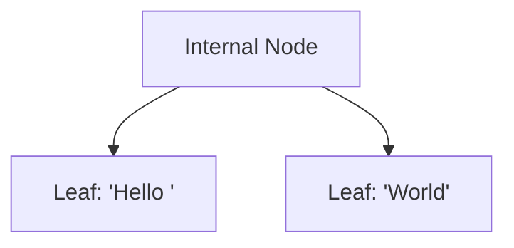
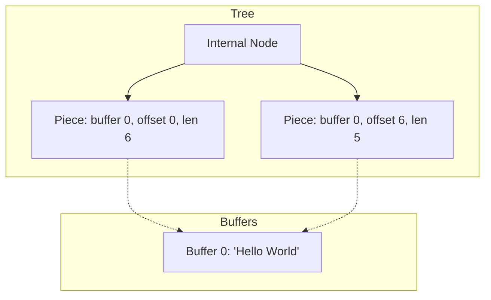
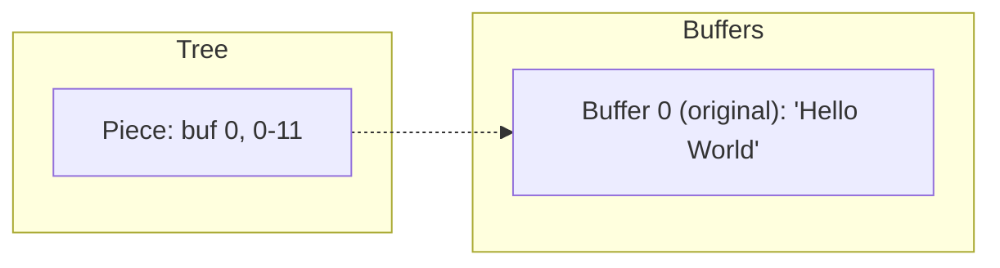
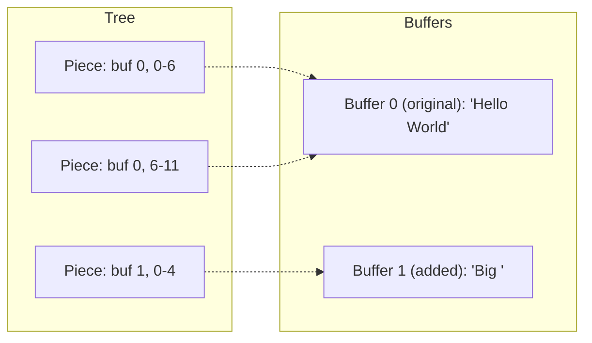
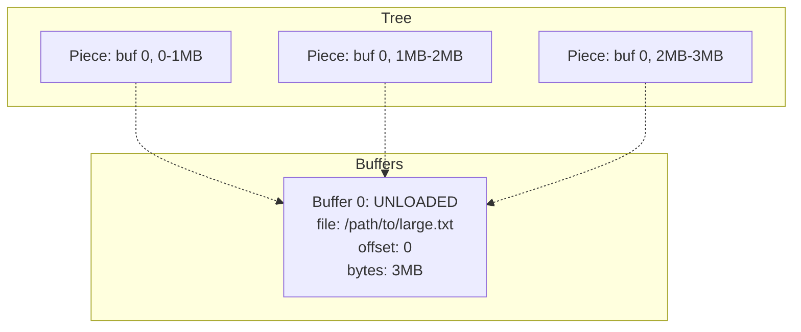
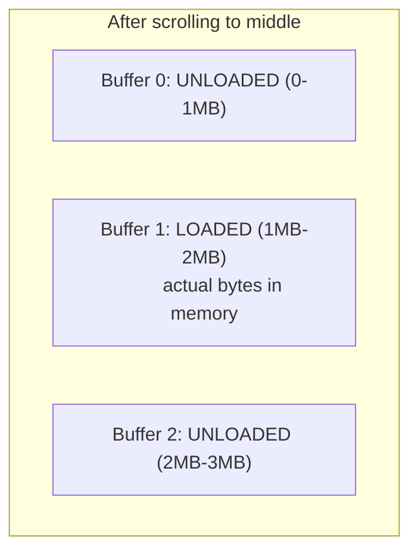
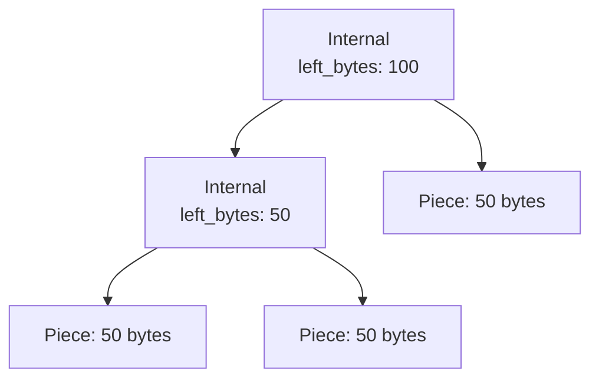
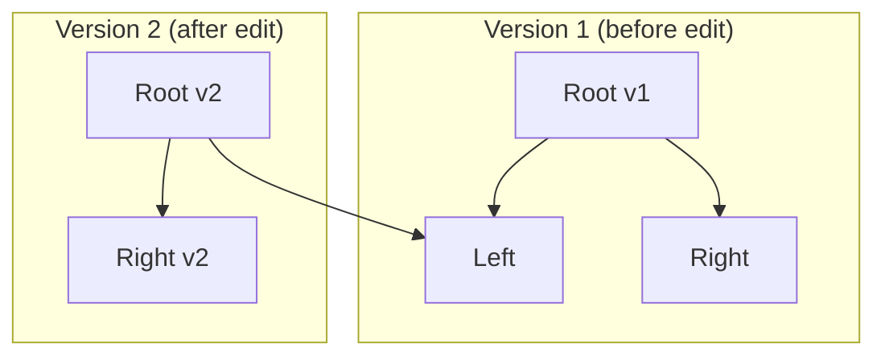

# Fresh Piece Tree Architecture

Fresh uses a **piece tree** (also called a piece table) for text storage. This differs from most editors which store text directly in tree nodes.

## The Core Idea

Instead of storing text in the tree, store **pointers** to text that lives elsewhere.

### Traditional Rope (most editors)

Text lives inside tree nodes:



### Piece Tree (Fresh)

Tree nodes point to separate buffers:



A **piece** is just three numbers: which buffer, starting offset, and length.

## What Happens When You Edit

When you type or paste, Fresh appends to a new buffer and creates a piece pointing to it. The original buffer stays untouched.

### Before: File contains "Hello World"



### After: Insert "Big " at position 6



Document now reads: "Hello Big World"

The original file content in Buffer 0 was never modified or copied.

## Lazy Loading

For large files, Fresh doesn't load the entire file into memory. Buffers can be **unloaded** - they store a file path and byte range instead of actual data.



When you scroll to a region, Fresh loads only that chunk from disk:



## Zero-Copy Reads

When reading text for display, Fresh doesn't copy bytes. It returns slices pointing directly into the buffers:

```rust
// Returns &[u8] pointing into buffer memory
// No allocation, no copy
let text = buffer.get_text_range(100, 200);
```

Multiple pieces can reference the same buffer region. Displaying the same text twice doesn't double memory usage.

## The Tree Structure

The pieces are organized in a balanced binary tree for fast lookups:



Each internal node caches the total bytes in its left subtree. To find byte offset 75:

1. Root has `left_bytes: 100`, and 75 < 100, so go left
2. Internal has `left_bytes: 50`, and 75 >= 50, so go right with offset 75-50=25
3. Piece has 50 bytes, offset 25 is within it

This is O(log P) where P is the number of pieces.

## Immutable Tree Structure

Fresh uses immutable nodes - once created, a node is never modified. Edits create new nodes instead.

> **Implementation note:** Fresh is written in Rust. Nodes are wrapped in `Arc<T>` (Atomic Reference Counted pointer), which allows multiple owners to share the same data. When all owners are gone, the data is freed. We'll gloss over this detail in the rest of the document - just know that "sharing" a node is cheap and safe.

After an edit, old tree versions remain valid:



Version 2 shares the unchanged left subtree with Version 1. This enables:

- Undo/redo by keeping old root references
- Concurrent reads without locks
- Cheap snapshots

## Fresh vs VS Code

VS Code also uses a piece tree. The core idea is identical, but the designs diverge on one key question: mutable or immutable nodes?

**VS Code**: Mutable tree. Edits modify nodes in place using red-black tree rotations. Undo/redo is handled by a separate layer that stores edit operations.

**Fresh**: Immutable nodes. Edits produce new tree versions while old versions remain valid, with unchanged subtrees shared between versions. (This is known as a [persistent data structure](https://en.wikipedia.org/wiki/Persistent_data_structure) in CS literature.)

### Inherent Trade-offs

**Immutable (Fresh):**
- Old tree versions stay valid - enables cheap snapshots and structural sharing
- Concurrent reads need no synchronization
- Undo can be "keep the old root" instead of "replay operations backward"
- More allocations per edit (new nodes along modified path)

**Mutable (VS Code):**
- Edits modify in place - less allocation overhead
- Requires separate undo infrastructure
- Concurrent access needs care

**Lazy loading** is orthogonal to mutability, but Fresh implements it and VS Code doesn't. Fresh can leave file regions on disk until accessed; VS Code loads the entire file.

*(Fresh's current implementation doesn't fully exploit immutability - it rebuilds the entire tree on each edit rather than path-copying. VS Code also has optimizations like search caching and line content caching that Fresh lacks. These are implementation gaps, not inherent to the designs.)*

## Comparison: Piece Tree vs Rope

| Aspect | Piece Tree (Fresh) | Rope (most editors) |
|--------|-------------------|---------------------|
| Node contents | Pointer to buffer | Actual text (~1KB) |
| Insert | Append to buffer, add piece | May copy/split chunk |
| Original file | Preserved in buffer 0 | Reorganized into chunks |
| Large files | Lazy load regions | Must load or stream |
| Memory for edits | Minimal (just pointers) | Copies chunk data |

## Trade-offs

**Advantages:**

- Original file content preserved (useful for diffs, minimal saves)
- Inserts never copy existing text
- Natural lazy loading for large files
- Pieces are small (~24 bytes) - more fit in CPU cache during tree traversal

**Disadvantages:**

- Extra indirection: find piece, then fetch from buffer
- Buffer fragmentation over many edits (many small buffers)
- Cache locality for text is poor (data scattered across buffers)
- No automatic chunk coalescing (piece count grows with edits)

*(Note: Fresh's current implementation also rebuilds the entire tree on each edit - O(P) instead of O(log P). This is an implementation gap, not inherent to piece trees.)*

## Further Reading

- [VS Code's Piece Table](https://code.visualstudio.com/blogs/2018/03/23/text-buffer-reimplementation) - Microsoft's write-up on adopting piece tables
- [VS Code Source: pieceTreeBase.ts](https://github.com/microsoft/vscode/blob/main/src/vs/editor/common/model/pieceTreeTextBuffer/pieceTreeBase.ts) - The actual implementation
- [Original Piece Table Paper](https://www.cs.unm.edu/~crowley/papers/sds.pdf) - J. Crowley, 1998
