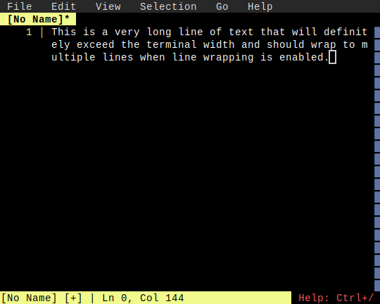
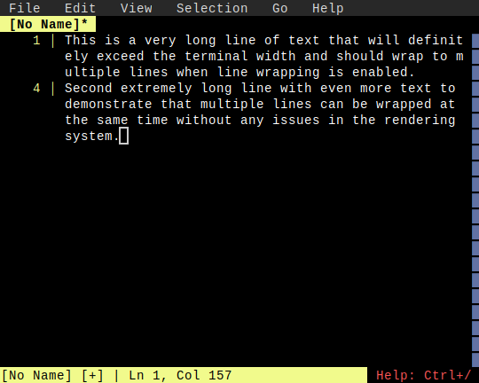
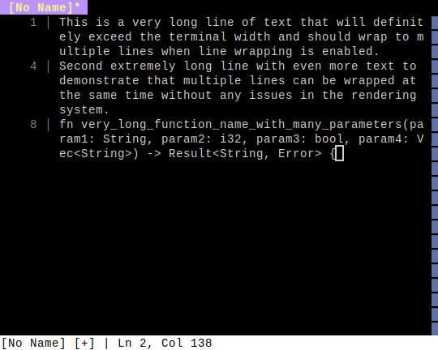

# Line Wrapping

**Category**: View Options

*Wrapping long lines at terminal width*

---

## Step 1: long_line_wrapped

*Long line automatically wrapped (enabled by default)*

## Step 2: multiple_wrapped

*Multiple long lines wrapped*

## Step 3: wrapped_code

*Long code line wrapped with syntax intact*

