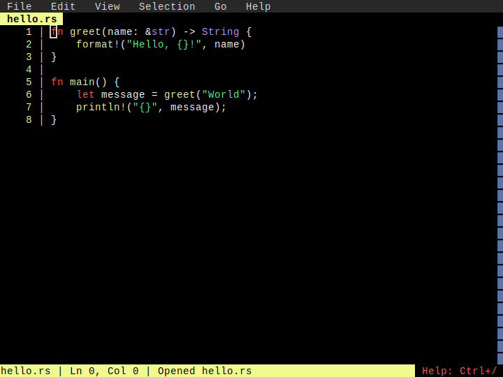
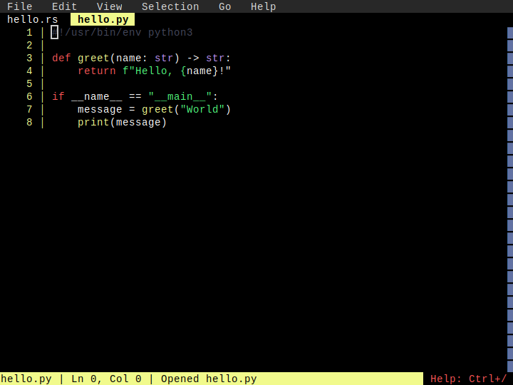
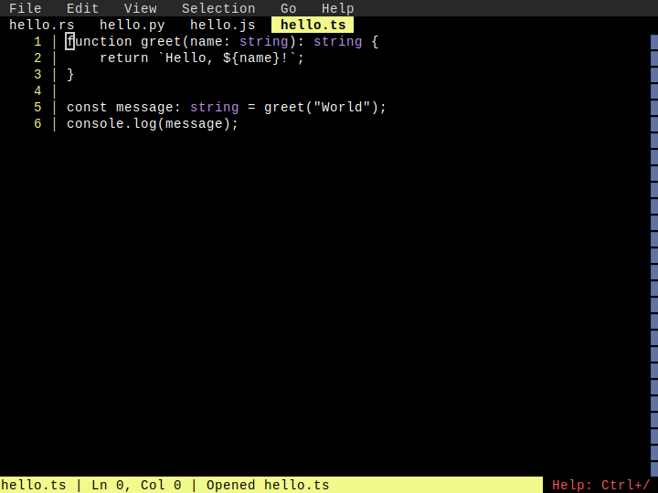
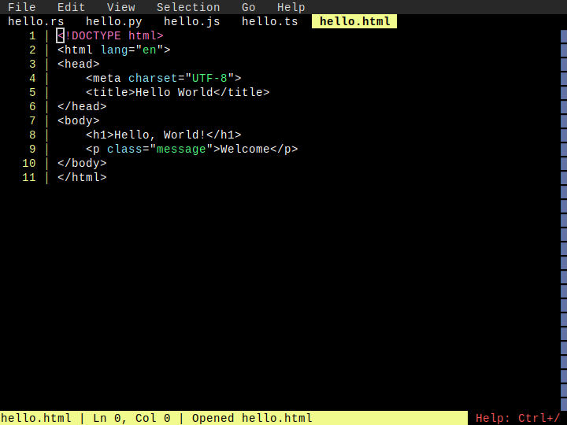
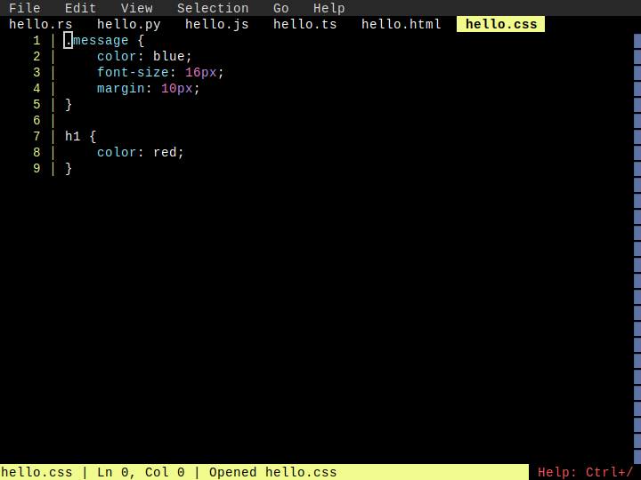
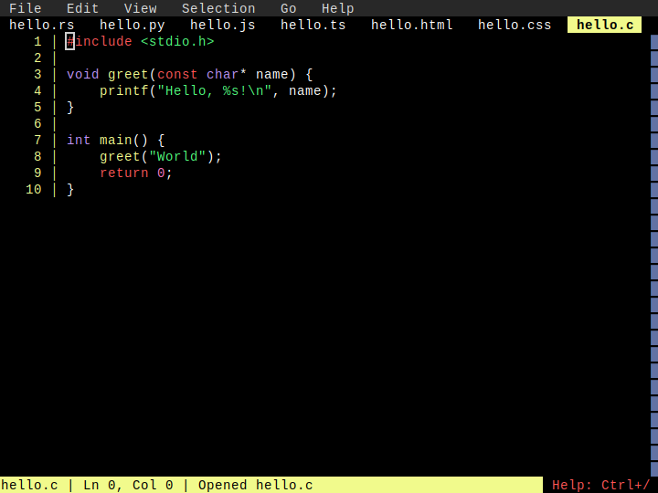
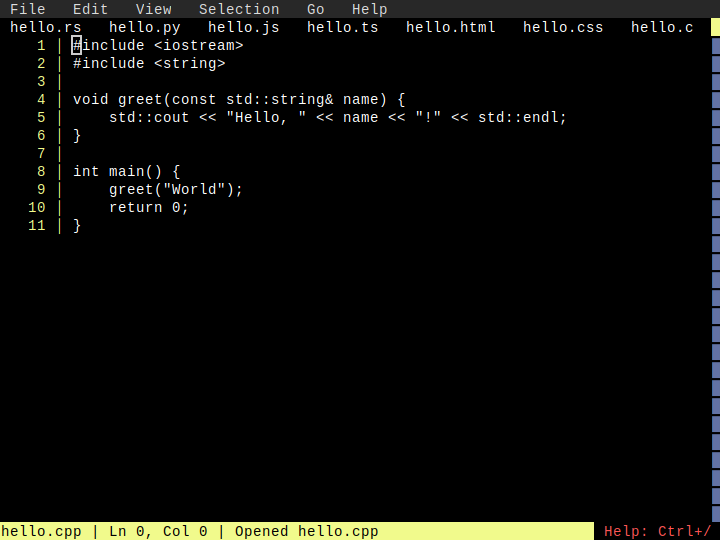

# Multi-Language Highlighting

**Category**: Syntax Highlighting

*Syntax highlighting working across all supported programming languages*

---

## Step 1: rust_highlighting

*Rust code with syntax highlighting*

## Step 2: python_highlighting

*Python code with syntax highlighting*

## Step 3: javascript_highlighting

*JavaScript code with syntax highlighting*

## Step 4: typescript_highlighting

*TypeScript code with syntax highlighting*

## Step 5: html_highlighting

*HTML code with syntax highlighting*

## Step 6: css_highlighting

*CSS code with syntax highlighting*

## Step 7: c_highlighting

*C code with syntax highlighting*

## Step 8: cplusplus_highlighting

*C++ code with syntax highlighting*

## Step 9: go_highlighting

*Go code with syntax highlighting*

